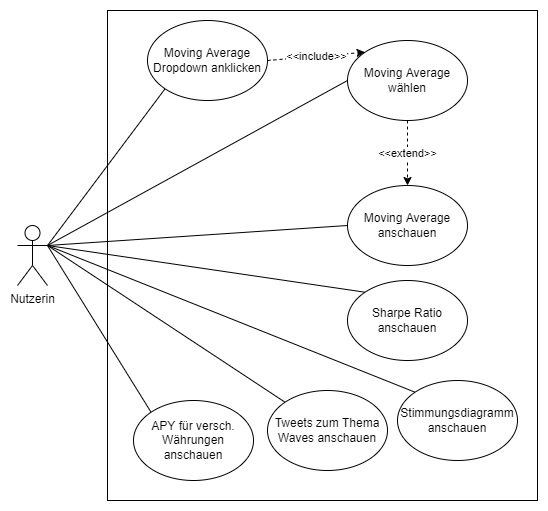
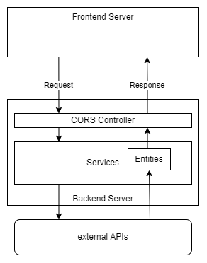

# VS Projektarbeit

## TL;DR
### Deployment
|                 | Link                                                       |
|-----------------|------------------------------------------------------------|
| Frontend        | https://hrw-vs-app.herokuapp.com/                          |
| Backend         | https://hrw-vs-backend.herokuapp.com/                      |
| Swagger Backend | https://hrw-vs-backend.herokuapp.com/swagger-ui/index.html |
| git             | https://gitlab.hs-ruhrwest.de/cvgehein/vs-projektarbeit    |
| Dokumentation   | [Dokumentation](Dokumentation.pdf)                         |
| Swagger Doku    | [Swagger Doku](swagger.yml)                                |

Anmerkung: Wenn es innerhalb 30 Minuten keinen Web-Traffic auf der Seite gab geht der Server in den Schlafmodus.
Er benötigt dann bei einem erneuten Zugriff eine kurze Zeit bis die Seite wieder geladen ist.

### Gruppenteilnehmer, Gruppe 4
| Autoren          | Matrikelnummer | Email                                |
|------------------|----------------|--------------------------------------|
| Dennis Brunne    |        |     |
| Jerome Gilgen    |        |     |
| Nils Milewski    |        |     |
| Maximilian Hofer |        |  |
| Gereon Heinemann |        |  |

## Dokumentation

### Benutzerszenario und Konzept
Die Nutzerin kann auf der Oberfläche des MashUp unterschiedliche Zeiträume des Moving Average der Kryptowährung Wave betrachten. Sie kann zwischen von den Entwicklern vor definierten Zeiträume wählen und individuellen Zeiträumen wählen. So bekommt die Nutzerin die Möglichkeit sich individuelle Informationen zu beschaffen.  Die Auswahl erfolgt über ein Dropdown Menü.  Zudem kann sie sich den Sharpe Ratio Wert der oben genannten Kryptowährung anzeigen lassen..Sie kann sich ebenfalls die Stimmung bezüglich Waves anschauen. Das kann sie mittels eines Tortendiagramms machen oder sich die Tweets, die dieses Stimmungsbild erzeugen, anschauen. Sie kann auch die annual percentage yield (APY) verschiedener Währungen im Vergleich anschauen.  
  

Das Konzept für die architektonische Lösung der Aufgabe ist in folgendem Diagramm abgebildet:  


Als Code-Basis haben wir ein Mono-Repository angelegt, in dem Backend und Frontend gemeinsam verwaltet werden. Das Repository kann unter folgendem Link erreicht werden [g].

### Backend
Das Backend wurde mit Spring Boot umgesetzt, da es ein umfangreiches Java Framework ist, mit dem sich jeder der Gruppenteilnehmer auskennt. Als Build Tool haben wir Maven gewählt. Mit Ausnahme der Controller- und trivialen Methoden (Getter, Setter, Constructoren) wurden alle public Methoden mit Javadoc dokumentiert. Die Controller-Methoden wurden gesondert für Swagger dokumentiert, da diese Schnittstellen nach Außen sichtbar sind.
#### A.	Aufbau
Das Backend ist nach der klassischen Layer-Architektur aufgebaut. Die Controllers bieten die nach außen sichtbaren endpoints an und leiten die Anfragen direkt an den service layer weiter. Im service layer findet der Großteil der Logik statt. Beispielsweise im WavesService wird mittels der WavesUtils-Klasse die wavescap-API angesprochen, die Response in ein POJO gemappt und zurück an den Controller gesendet. Diese POJOs sind im package entities definiert und dort ebenfalls mittels Javadoc dokumentiert. Da die twitter api umfangreicher als die anderen APIs sind wurden die twitter services in einem eigenen package umgesetzt.
#### B. Besonderheiten
Insgesamt spricht das Backend vier externe Dienste an, um Daten für das Frontend zu aggregieren: wavescap, pywaves, twitter und azure. Die genauen Link zu den Diensten sind im Anhang ([a] - [d]) zu finden.
Da die meisten Twitter Bibliotheken eine restriktivere Authentifizierung gegenüber der API benutzen wird eine eigens aufgebaute HttpRequest genutzt welche lediglich ein API Token für die Authentifizierung benutzt. Die Twitter Einbindung ist modular aufgebaut was ein zukünftiges nutzen in weiteren Projekten ermöglicht.
Zur Sentimentanalyse haben wir das Azure Language Model benutzt. Dies geschah aus zwei Gründen. Das vorher verwendete NLP Modul der Stanford NLP Group bietet zwar ein trainiertes Model an, ist aber nicht über eine API ansprechbar und muss somit komplett in den Code geladen werden [e]. Dies hätte zwar den Vorteil, dass Backend weiterhin Sentimentanalysen durchführen hätte können, wenn die externe API nicht mehr verfügbar ist, aber dadurch ist das Backend-Projekt auf eine Größe über 500 MB angestiegen. Die Nutzung des Azure Language Models war für uns dann die nächst bessere Alternative. Außerdem würde die Nutzung des Azure Language Models eine Erweiterung um Module, die das Natural Language Processing verwenden, einfach umzusetzen sein. Denkbar wäre hier die Stimmungsanalyse durch eine automatisierte Zusammenfassung aller Tweets oder einfache Fragen über einen Chatbot zu beantworten. Dies war aber nicht Teil des Umfangs der Aufgabenstellung.
Der Wert für die risikofreie Rendite richtet sich nach deutschen Staatsanleihen für einen einjährigen Zeitraum. Die entsprechende Quelle befindet sich im Anhang. [j] Die Rendite und Standardabweichung betrachten ebenfalls einen einjährigen Zeitraum. Für die Berechnungen der Standardabweichung wurde Methoden aus der Apache Commons Bibliothek benutzt. [k]
Der geforderte Umgang mit der Same-Origin-Policy haben wir mittels Cross-Origin Resource Sharing (CORS) gelöst. Wie im Konzept bereits dargestellt werden requests vom Frontend Server in den Controllern des Backends explizit freigegeben. Somit ist nur der Frontend Server berechtigt Anfragen an diese Controller zu stellen. Damit wird explizit mit der Same-Origin-Policy umgegangen und gelöst.
#### C. Limitierung
Das Backend ist darauf angewiesen, dass alle vier APIs unter den angegebenen Links funktionieren. Sollte sich der Link ändern oder der Dienst nicht mehr erreichbar sein, dann funktioniert die Oberfläche ebenfalls nicht mehr.
In der Gratisversion hat die Twitter-API eine Limitierung sowohl in den monatlichen Requests als auch in den Requests pro 15 Minuten. Ein allzu häufiges Aufrufen der Sentimentanalyse führt also unweigerlich dazu, dass die Twitter-API keine Antwort mehr sendet.


### Frontend
Das Frontend wurde mit ReactJS realisiert. Als Build Tool wurde sich für npm entschieden.
#### A. Besonderheiten
Zur Darstellung der einzelnen Graphen (Moving Average Chart und Segment Analysis Pie Chart) wurde die Highcharts Library genutzt bzw. dessen React Wrapper [l].
Zur Darstellung der mathematischen Formeln für Sharpe Ratio und Moving Average's Berechnungsgrundlage wurde MathJax genutzt.[m].
#### B. Limitierung
Das Frontend ist darauf angewiesen, dass die jeweiligen API-Endpunkte im Backend erreichbar sind.


### Deployment
Ein lokales Deployment setzt für das Backend maven voraus, für das Frontend nodejs.
Um das Backend lokal zu starten sind folgende Befehle vom root folder aus auszuführen:
```sh
cd backend
mvn spring-boot:run
```

Um das Frontend lokal zu starten sind folgende Befehle vom root folder aus auszuführen:
```sh
cd frontend
npm install
npm start
```

Backend und Frontend werden bei heroku gehostet. Heroku ist ein Anbieter aus den USA, der gratis hosting von verschiedenen Projekten übernimmt. Um ein Projekt auf heroku hosten zu können, muss ein Account erstellt werden und über git an ein repository von heroku gepusht werden. Heroku erkennt dann anhand der Projektstruktur den Typ (beispielsweise Java Spring oder ReactJS) und führt entsprechende Scripts aus, um das Projekt unter einer öffentlich zugänglichen URL verfügbar zu machen. Für das Backend sind wir diesem Guide gefolgt [f].
Die Swagger API des Backend-Projekts ist unter folgendem Link verfügbar [h]. Das Frontend ist unter folgendem Link verfügbar [i].

### Links


|     | Link                                                                                                              |
|-----|-------------------------------------------------------------------------------------------------------------------|
| [a] | https://wavescap.com/api/asset/WAVES.json und https://wavescap.com/api/chart/asset/WAVES-usd-n-1y.json            |
| [b] | https://dev.pywaves.org/neutrino/json                                                                             |
| [c] | https://api.twitter.com/2/tweets/search/recent                                                                    |
| [d] | https://vs-sentiment-analysis.cognitiveservices.azure.com/                                                        |
| [e] | https://stanfordnlp.github.io/CoreNLP/                                                                            |
| [f] | https://devcenter.heroku.com/articles/deploying-spring-boot-apps-to-heroku#preparing-a-spring-boot-app-for-heroku |
| [g] | https://gitlab.hs-ruhrwest.de/cvgehein/vs-projektarbeit                                                           |
| [h] | https://hrw-vs-backend.herokuapp.com/swagger-ui/index.html                                                        |
| [i] | https://hrw-vs-app.herokuapp.com/                                                                                 |
| [j] | https://de.investing.com/rates-bonds/germany-government-bonds?maturity_from=40&maturity_to=90                     |
| [k] | https://commons.apache.org                                                                                        |
| [l] | https://github.com/highcharts/highcharts-react                                                                    |  
| [m] | https://www.mathjax.org/                                                                                          |
